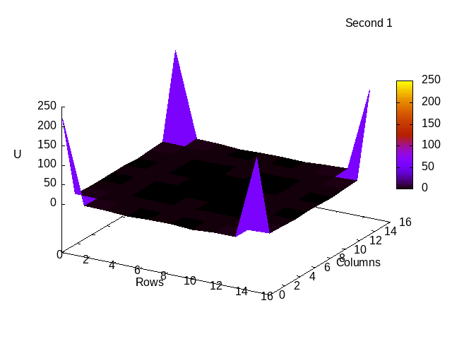

# RC Grid Simulation

Multithreaded numerical simulation of transient voltage propagation
in a two-dimensional rectangular RC grid using the nodal analysis method
and explicit Euler time integration.

The project demonstrates parallel computation, numerical modeling
of physical systems, and performance scaling compared to a sequential
implementation.

---

## Problem Description

The system models voltage propagation in a 2D grid of identical RC elements.
Each grid node represents an electrical node connected to its neighbors
through resistive and capacitive elements.

The mathematical model is constructed using the **nodal analysis method**.
Time integration is performed using the **explicit Euler method**.
An external voltage source is applied as a boundary condition.

<p align="center">
  
</p>
<p align="center">
  <em>Voltage propagation in a 16×16 RC grid with a sinusoidal source</em>
</p>

---

## Key Features

- Numerical simulation of transient processes in RC networks
- Explicit Euler method for time integration
- Nodal analysis–based mathematical model
- Multithreaded implementation using **POSIX threads**
- Barrier-based synchronization between computation stages
- Performance comparison with a sequential approach
- Visualization of simulation results using **gnuplot**

---

## Input Parameters

The program accepts the following command-line arguments: <rows_amount> <cols_amount> <simulation_time> <threads_amount>.
- `rows_amount` — number of rows in the grid (must be divisible by the number of threads)
- `cols_amount` — number of columns in the grid
- `simulation_time` — number of simulated time steps
- `threads_amount` — number of worker threads

## Output

- `output.txt` — voltage values for all grid nodes at each time step
- `grid.gif` — animated visualization of voltage propagation (gnuplot)

The visualization is generated **after** the computation completes.

---

## Build and Run

Compile using a POSIX-compliant compiler:

```bash
gcc -O2 -pthread main.c -lm -o rc_grid
```

Run example:
```bash
./rc_grid 16 16 30 8
```

---

# Details

## Technologies Used
- C (POSIX)
- pthreads
- gnuplot
- Explicit numerical methods

## Parallelization Strategy

The grid is partitioned row-wise between threads.
Each thread processes a contiguous block of rows.

Synchronization is performed using two barriers:
- one before starting computations for the next time step
- one after completing computations

This guarantees correctness while allowing parallel updates
of independent grid regions.

## Boundary Conditions

- Corner nodes are fixed to the external voltage source
- Edge nodes are computed using reduced neighbor sets
- Internal nodes use a full four-neighbor stencil

The voltage source can be configured as:
- constant
- sinusoidal
